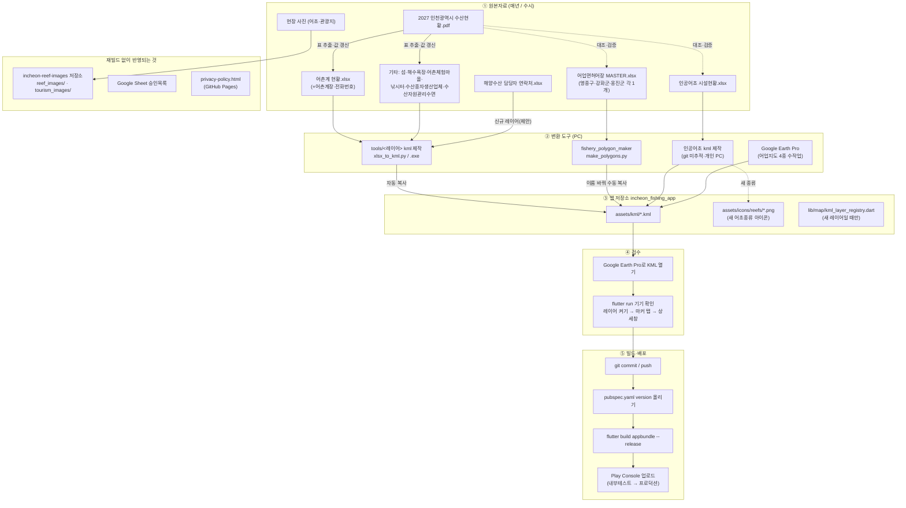

# 인천 해양수산 정보 서비스 — 정보 갱신 가이드

앱에 담긴 정보(어업면허어장, 인공어초, 어촌계 등)를 새 원본자료로 바꾸는 절차와
그때 쓰는 도구를 작업 순서대로 정리한 문서입니다.
기준일: 2026-09-13. 코드·도구 위치는 아래 저장소 기준입니다.

---

## 0. 구성요소 한눈에 보기

앱은 하나지만 정보가 들어가는 통로는 넷입니다. **어느 통로냐에 따라 "앱을 다시 빌드해서
배포해야 하는지"가 갈립니다.**

| 통로 | 담기는 정보 | 갱신 방법 | 재빌드·재배포 |
| --- | --- | --- | --- |
| A. 앱 번들 (`assets/kml/*.kml`) | 지도 레이어 15종 전부 (면허어장, 인공어초, 어촌계, 섬, 해수욕장 …) | 엑셀 → 도구 → KML 교체 → 빌드 | **필요** |
| B. 사진 CDN (GitHub → jsDelivr) | 인공어초 사진, 해수욕장·어촌체험마을 사진 | `incheon-reef-images` 저장소에 파일 올리기 | 불필요 |
| C. Google Sheet + Apps Script | 사용자 승인목록, 현장기록 제출함 | 시트 편집 | 불필요 |
| D. 외부 API | 조석·날씨·수온·해상특보 (공공데이터포털, 국립해양조사원) | 서비스키만 관리 | 키 바꿀 때만 |

관련 저장소와 자료 위치:

| 이름 | 역할 | 위치 |
| --- | --- | --- |
| `incheon_fishing_app` | **앱 본체** (Flutter, 패키지 `com.g001485.incheon_fisheries_info`) | GitHub `g001485-rgb/incheon_fishing_app` |
| `incheon_fishing_app/tools/` | 엑셀→KML 변환 도구 7종 + 생성기 | 위 저장소 안 |
| `fishery_polygon_maker` | 어업면허어장 엑셀→KML/GeoJSON 변환 | GitHub `g001485-rgb/fishery_polygon_maker` |
| `incheon-reef-images` | 사진 CDN 원본 (jsDelivr가 서빙) | GitHub `g001485-rgb/incheon-reef-images` |
| `incheon-fisheries-privacy` | 개인정보처리방침 웹페이지 + 이 문서 | GitHub `g001485-rgb/incheon-fisheries-privacy` |
| `incheon_ocean_fisheries_platform` | 내부망용 웹 플랫폼(별도 사업, 앱과 데이터 공유 없음) | GitHub 비공개 |
| Google Sheet「인천 해양수산 정보 서비스」 | 승인목록·제출함 | Drive 앱 폴더 |
| Drive 앱 폴더 | `00_관리대장 / 01_KML / 02_GeoJSON / 03_version / 99_백업`, 서명키, aab | Google Drive |

---

## 1. 전체 작업 흐름도



---

## 2. 원본자료 ↔ 앱 반영 대상 매핑

말씀하신 원본자료 5종에 대해 "어디로 들어가는지"를 먼저 정리합니다.

| 원본자료 | 앱에서 바뀌는 것 | 쓰는 도구 | 비고 |
| --- | --- | --- | --- |
| **2027년 인천광역시 수산현황.pdf** | 직접 읽는 곳 없음. **모든 레이어 엑셀의 상위 원본**입니다. 어촌계·수산종자생산업체·해수욕장·낚시터·섬·어촌체험마을·수산자원관리수면 표가 여기서 나옵니다. | PDF 표 추출 → 각 도구의 input 엑셀 | 좌표(위도·경도)는 PDF에 없으므로 **기존 input 엑셀을 열어 값만 갱신**하는 방식이어야 합니다. |
| **인공어초 시설현황(엑셀)** | `artificial_reef_facility.kml` (798건) + 새 어초종류가 생기면 아이콘 | 「인공어초 kml 제작」도구 | 이 도구는 `tools/.gitignore`로 **git에서 제외되어 개인 PC에만 있습니다.** 3.5절에 출력 규격을 적어 두었습니다. |
| **어업면허어장(엑셀)** | `fishery_yeongjonggu.kml`, `fishery_ganghwa.kml`, `fishery_ongjin.kml` | `fishery_polygon_maker/make_polygons.py` | 군·구별 MASTER 엑셀 1개씩, 3번 돌립니다. 출력 파일명을 바꿔 수동 복사해야 합니다. |
| **해양수산 담당자 연락처** | **현재 앱에 대응 기능이 없습니다.** | (신규) 3.8절 제안 참고 | 기타 정보 카테고리에 KML 레이어로 넣는 것이 가장 적은 변경입니다. |
| **어촌계 연락처** | `fishing_village_association.kml` (58건) 상세창 | 「어촌계 kml 제작」도구 | 도구 설정이 현재 `fields=[]`라 이름·수협·좌표만 나옵니다. 어촌계장·전화번호 열을 살리려면 3.4절의 설정 변경이 먼저입니다. |

추가로 확인된 갱신 대상 (사용자 목록에 없던 것):

| 대상 | 파일 | 도구 | 원본 |
| --- | --- | --- | --- |
| 섬 (168곳, 유인도/무인도) | `incheon_island.kml` | 「섬 kml 제작」 | 인천 도서(섬) 현황_2026.xlsx |
| 해수욕장 | `beach.kml` | 「해수욕장 kml 제작」 | 인천 해수욕장 현황.xlsx (+사진 URL) |
| 어촌체험마을 | `fishing_experience_village.kml` | 「어촌체험마을 kml 제작」 | 인천 어촌체험마을 현황.xlsx (+사진 URL) |
| 낚시터 | `fishing_spot.kml` | 「낚시터 kml 제작」 | 인천 낚시터 현황.xlsx |
| 수산종자생산업체 | `fish_seed_producer.kml` | 「수산종자생산업체 kml 제작」 | 인천 수산종자생산업체 현황.xlsx |
| 수산자원관리수면 (25구역) | `fishery_resource_management_zone.kml` | 「수산자원관리수면 kml 제작」 | 인천 수산자원관리수면 현황.xlsx (2시트) |
| 어업지도 4종: 선박안전 조업규칙 · 어로구역 · 야간조업 항해금지구역 · 항만구역 | `fishery_guidance_*.kml`, `harbor_zone.kml` | 없음 (Google Earth 수작업) | 고시·훈령 |
| 인공어초 사진 · 관광지 사진 | CDN | GitHub 업로드 | 현장 촬영본 |
| 사용자 승인목록 | Google Sheet | 시트 편집 | 신청 접수 |
| 개인정보처리방침 (문의처·시행일) | `privacy-policy.html` | 이 저장소 편집 | 담당자 변경 시 |
| 조석·수온 관측소 목록 | `_sea_temperature_stations.dart`, `tide_api_service.dart` (코드 안 하드코딩) | 코드 수정 | 국립해양조사원 관측소 변경 시 |
| 공공데이터포털 서비스키, Google Maps 키 | `api_keys.dart`, `AndroidManifest.xml` | 코드 수정 | 만료·교체 시 |

---

## 3. 단계별 절차

### 3.1 준비물 (작업 PC)

- Flutter SDK (앱 빌드), Android Studio 또는 명령줄 빌드 환경
- Python 3 + `openpyxl` (템플릿 도구), `pandas` (면허어장 도구)
  ```sh
  pip install openpyxl pandas
  ```
- Google Earth Pro (KML 검수용)
- git, GitHub 계정 (`g001485-rgb`)
- 서명키: `android/key.properties` + `upload-keystore.jks` (Drive 앱 폴더에 백업본 있음. 없으면 Play 업로드 불가)
- 앱 저장소 최신 상태:
  ```sh
  git clone https://github.com/g001485-rgb/incheon_fishing_app
  cd incheon_fishing_app && flutter pub get
  ```

### 3.2 공통: PDF → 도구용 엑셀 만들기

수산현황 PDF는 매년 표 구조가 거의 같으므로, **새 엑셀을 만들지 말고 작년 input 엑셀을 열어 값만 갱신**합니다. 이유는 두 가지입니다.

1. 도구는 **시트명과 1행 열 제목이 정확히 일치**해야 돌아갑니다 (다르면 `[오류] '…' 열이 없습니다`로 멈춤).
2. 위도·경도는 PDF에 없습니다. 기존 행의 좌표를 그대로 써야 합니다.

권장 순서:

1. PDF에서 해당 표를 추출합니다. Acrobat「스프레드시트로 내보내기」, 한컴오피스, 또는 Python `pdfplumber` 어느 것이든 됩니다.
2. 추출한 표와 작년 input 엑셀을 나란히 놓고 **추가·삭제·변경된 행**을 표시합니다.
3. 작년 엑셀에 반영합니다. 신규 행은 좌표를 별도로 확보합니다 (Google Earth에서 찍거나 담당 부서 확인).
4. 파일명은 도구가 요구하는 이름 그대로 저장합니다 (아래 표).
5. 갱신한 엑셀은 Drive `00_관리대장`에 연도 붙여 보관합니다 (예: `인천 어촌계 현황_2027.xlsx`). 원본 보존 원칙.

### 3.3 템플릿형 도구 5종 + 섬 + 수산자원관리수면 (`incheon_fishing_app/tools/`)

7개 폴더가 같은 방식으로 동작합니다.

```
tools/<레이어> kml 제작/
  ├─ input/          ← 엑셀을 여기에 (정확한 파일명)
  ├─ output/         ← 변환된 KML (Google Earth로 열어 확인)
  ├─ xlsx_to_kml.py  ← 변환 스크립트
  ├─ <레이어> KML 제작.exe ← 더블클릭 실행판 (git 미포함, PyInstaller로 만든 것)
  └─ 사용법.txt
```

실행:

```sh
# 방법 1: exe 더블클릭
# 방법 2: 명령줄
cd "tools/어촌계 kml 제작"
python xlsx_to_kml.py
```

성공 메시지는 `변환 완료: N개 (검증 통과)` 이고, 이어서 `assets/kml/<파일>.kml`에 **자동 복사**됩니다. `[경고] placemark N개 != 엑셀 M행`이 나오면 결과를 쓰지 말고 엑셀을 확인합니다.

| 도구 폴더 | 입력 엑셀 파일명 (input/) | 시트명 | 필수 열 | 상세창에 나가는 열 | 출력 KML |
| --- | --- | --- | --- | --- | --- |
| 어촌계 kml 제작 | 인천 어촌계 현황.xlsx | 어촌계 현황 | 수협, 어촌계, 위도, 경도 | (없음 — 3.4절 참고) | fishing_village_association.kml |
| 수산종자생산업체 kml 제작 | 인천 수산종자생산업체 현황.xlsx | 수산종자생산업체 | 관할, 구분, 허가번호, 위도, 경도, 어업종류 | 어업종류, 허가번호(면허,신고), 상호, 어업(양식)방법, 어장위치, 수면적(㎡), 면적(ha), 품종, 어업권 기간 | fish_seed_producer.kml |
| 해수욕장 kml 제작 | 인천 해수욕장 현황.xlsx | 해수욕장 현황 | 관할, 지역, 해수욕장명, 위도, 경도 | 소개, 주소, 전화번호, 입장료, 관리부서, 홈페이지, 시설물, 기타, 이미지 | beach.kml |
| 어촌체험마을 kml 제작 | 인천 어촌체험마을 현황.xlsx | 어촌체험마을 | 관할, 마을명, 위도, 경도 | 명칭, 면적, 위치, 연락처, 홈페이지, 이용금액, 기타, 이미지 | fishing_experience_village.kml |
| 낚시터 kml 제작 | 인천 낚시터 현황.xlsx | 낚시터 현황 | 관할, 낚시터명, 위도, 경도 | 수면적, 포획물, 주소, 연락처, 이용료, 홈페이지, 기타 | fishing_spot.kml |
| 섬 kml 제작 | 인천 도서(섬) 현황_2026.xlsx | 유인도 / 무인도 | 관할, 섬 이름, 위도, 경도 (무인도: 지정, 관리번호) | 시트의 나머지 열 | incheon_island.kml |
| 수산자원관리수면 kml 제작 | 인천 수산자원관리수면 현황.xlsx | 기본정보 / 좌표정보 | 기본정보: 연도, 지정번호 · 좌표정보: 지정번호, 좌표순번, 위도, 경도 | 지정번호, 위치, 지정연도, 시설연도, 지정기간, 사업종류, 면적, 시설물량 | fishery_resource_management_zone.kml |

엑셀 작성 규칙 (도구 공통):

- `기타` 열은 `라벨 : 값` 형식으로 한 줄씩 줄바꿈. 상세창에 항목으로 풀립니다.
- `이미지` 열은 사진 URL을 줄바꿈으로 나열. URL은 반드시 `https://` (http는 무시됨).
- 값이 `-` 이거나 비어 있으면 그 항목은 상세창에서 빠집니다.
- 수산자원관리수면의 `연도`, 수산종자생산업체의 `어업종류`, 섬 무인도의 `관리번호`는 **마커 색을 정하는 값**이라 비우면 안 됩니다.
- 섬 파일명에 연도(`_2026`)가 박혀 있습니다. 2027년 파일을 쓰려면 파일명을 그대로 맞추거나 `xlsx_to_kml.py`의 `EXCEL_NAME`을 바꿉니다.

**도구 5종의 공통 로직을 고칠 때**: 각 폴더를 따로 고치지 말고 `tools/_generator/gen_tools.py`의 `TEMPLATE`·`LAYERS`를 고친 뒤 실행하면 5개 폴더의 스크립트·사용법이 다시 생성됩니다. 그 다음 exe도 다시 만들어야 합니다.

```sh
cd tools/_generator && python gen_tools.py
python -m PyInstaller --onefile --name "어촌계 KML 제작" --distpath "../어촌계 kml 제작" "../어촌계 kml 제작/xlsx_to_kml.py"
```

### 3.4 어촌계 연락처 살리기 (설정 변경 1회 필요)

현재 `gen_tools.py`의 어촌계 항목은 `fields=[]` 라서 엑셀에 어촌계장·전화번호 열을 넣어도 KML에 실리지 않습니다 (2026-07-17 커밋 메시지에는 "열 추가"라고 적혀 있으나 실제 코드에는 반영되어 있지 않습니다).

바꿀 곳: `tools/_generator/gen_tools.py` → `LAYERS` 의 어촌계 항목

```python
dict(
    folder="어촌계 kml 제작", title="어촌계", excel="인천 어촌계 현황.xlsx",
    asset="fishing_village_association.kml", sheet="어촌계 현황", doc_name="어촌계 현황",
    name_col="어촌계", group_cols=["수협"],
    fields=["어촌계장", "전화번호"],          # ← 여기
    name_as_field='"어촌계"', etc_col="None", image_col="None",
    icon_color="ff00d7ff",
    required="수협, 어촌계, 위도, 경도",
    extra_rules="   - 어촌계장·전화번호는 비워도 됨 (입력된 값만 상세창에 표시)\n",
),
```

그 뒤 `python gen_tools.py` → 엑셀에 `어촌계장`, `전화번호` 열 추가 → 변환. 전화번호는 상세창에 글자로 표시됩니다 (탭해서 거는 기능은 없음. 필요하면 3.8절의 tel: 링크 추가와 함께 처리).

개인정보 주의: 어촌계장 개인 휴대폰은 개인정보입니다. 앱이 승인 사용자 전용이라도 **사무실·어촌계 대표번호 우선**으로 넣고, 개인 번호를 넣을 경우 개인정보처리방침에 "제3자 정보 게시" 항목 추가를 검토하세요.

### 3.5 어업면허어장 (`fishery_polygon_maker`)

군·구별로 MASTER 엑셀 1개씩, 3번 반복합니다. Drive에 `어업면허어장_옹진군_MASTER_260731_취합본.xlsx`가 이 양식의 예시입니다.

엑셀 구조 (2시트):

| 시트 | 필수 열 |
| --- | --- |
| 면허어장 기본정보 | 관리기관, ID, 면허번호, 어업종류, 어업방법, 양식물, 어장위치, 면적(ha), 어업권자, 면허시작일, 면허종료일, 면허구분 |
| 면허어장 좌표정보 | ID, 위도(D), 경도(D), (좌표순번 — 있으면 그 순서로 연결) |

- 두 시트는 `ID`로 연결됩니다 (예: `O-V-G-240`). 어장 하나에 좌표 3점 이상.
- `어업종류` 값에 따라 색이 정해집니다: 마을=자홍, 패류=노랑, 해조류=주황, 어류등=초록, 복합=파랑, 협동=군청. 이 색은 앱 범례(`lib/map/map_legend_panel.dart`)와 맞춰져 있으니 도구 쪽 `FISHERY_STYLE`을 바꾸면 범례도 같이 바꿉니다.
- 날짜는 엑셀 날짜형 또는 `YYYY-MM-DD`.

실행:

```sh
cd fishery_polygon_maker
# input/ 폴더에 엑셀 "하나만" 둡니다 (2개 이상이면 멈춤)
python make_polygons.py
# → output/<엑셀파일명>.kml , output/fishery_area_polygons.geojson
```

그 다음 **파일명을 바꿔 수동 복사**합니다 (이 도구는 자동 복사가 없습니다).

```sh
copy "output\어업면허어장_옹진군_MASTER_270115.kml" "..\incheon_fishing_app\assets\kml\fishery_ongjin.kml"
```

| 군·구 | 앱 파일명 |
| --- | --- |
| 영종구 (구 중구) | `assets/kml/fishery_yeongjonggu.kml` |
| 강화군 | `assets/kml/fishery_ganghwa.kml` |
| 옹진군 | `assets/kml/fishery_ongjin.kml` |

> **주의 — 옹진군은 최우선 갱신 대상입니다.** 앱에 들어 있는 `fishery_ongjin.kml`은 2023-07-27 영흥면 Google Earth 수작업본(102건, 속성 데이터 없음)이고, Drive에는 2026-07-31 옹진군 MASTER 엑셀이 있습니다. 이 도구로 한 번 돌려 교체하면 됩니다.

### 3.6 인공어초 (도구가 저장소 밖에 있음)

「인공어초 kml 제작」도구는 `tools/.gitignore`에 의해 git에 들어 있지 않습니다. 개인 PC에만 있으니 **먼저 그 폴더를 저장소에 넣거나 Drive에 백업**하세요. 분실 시 아래 규격대로 다시 만들면 됩니다.

앱이 읽는 KML 규격 (`assets/kml/artificial_reef_facility.kml`, 현재 798건):

```xml
<Style id="reef_사각"> … </Style>          <!-- 어초종류별 스타일 -->
<Placemark>
  <name>1</name>                            <!-- ID = 상세창 '시설명' -->
  <styleUrl>#reef_사각</styleUrl>
  <description><![CDATA[ …HTML 표(선택)… ]]></description>
  <ExtendedData>
    <Data name="ID"><value>1</value></Data>
    <Data name="위치"><value>옹진군 덕적면 가도</value></Data>
    <Data name="시설연도"><value>1973</value></Data>
    <Data name="어초종류"><value>사각어초</value></Data>
    <Data name="시설면적"><value>31</value></Data>
    <Data name="시설물량"><value>780</value></Data>
    <Data name="위도"><value>37.150017</value></Data>
    <Data name="경도"><value>126.016750</value></Data>
    <Data name="icon_file"><value>사각어초.png</value></Data>
    <Data name="image_file"><value>reef_1.jpg</value></Data>
  </ExtendedData>
  <Point><coordinates>126.01675000,37.15001700,0</coordinates></Point>
</Placemark>
```

앱 동작과 연결되는 규칙:

- `icon_file` → `assets/icons/reefs/<icon_file>` 을 마커 아이콘으로 씀. 없으면 `어초종류` 글자로 아이콘 파일명을 추정하고, 그래도 없으면 `default.png`.
- `image_file` → `https://cdn.jsdelivr.net/gh/g001485-rgb/incheon-reef-images@main/reef_images/<image_file>` 에서 사진을 받음.
- `icon_path`, `image_path` 열은 앱이 쓰지 않습니다 (있어도 무해).

**새 어초종류가 생기면** (현재 39종, 아이콘 79개):

1. `assets/icons/reefs/<종류명>.png` 아이콘 추가 (기존 파일과 같은 크기·투명배경).
2. `assets/icons/인공어초 명단.txt`에 종류명 추가 (참고 목록).
3. 엑셀 `icon_file` 열에 파일명 기입.

**새 어초 사진** → 3.9절 CDN 절차.

### 3.7 어업지도 4종 · 해양보호구역 (도구 없음)

`선박안전 조업규칙`, `어로구역`, `야간조업 항해금지구역`, `항만구역`은 Google Earth에서 그린 KML을 그대로 씁니다.

1. Google Earth Pro에서 기존 `assets/kml/<파일>.kml` 열기 → 폴리곤/선 수정, 설명은 `1. 항목: 값` 줄 형식 유지.
2. 「장소를 다른 이름으로 저장」→ KML(KMZ 아님) → 같은 파일명으로 `assets/kml/`에 덮어쓰기.
3. 색은 KML 안 `PolyStyle/LineStyle`이 아니라 앱 코드(`map_kml_feature_utils.dart`)가 이름 기준으로 정합니다 (어로한계선=빨강, 조업자제선=연두 등). 이름을 바꾸면 색도 바뀌니 주의.

`marine_protected_area.kml`은 assets에 있지만 `kml_layer_registry.dart`에 등록돼 있지 않아 **앱에 표시되지 않습니다.** 쓰려면 등록이 필요합니다.

### 3.8 (제안) 해양수산 담당자 연락처 — 신규 레이어로 추가

앱에 연락처 기능이 없으므로 새로 만들어야 합니다. 가장 적게 바꾸는 방법은 **기타 정보 카테고리에 KML 레이어 하나 추가**하는 것입니다. 지도의 기관 위치를 탭하면 상세창에 담당자·전화가 뜹니다.

1. 엑셀 `인천 해양수산 담당기관 연락처.xlsx`, 시트 `담당기관`: `기관, 부서, 담당업무, 담당자, 전화번호, 팩스, 주소, 위도, 경도, 기타`
2. `gen_tools.py`의 `LAYERS`에 항목 추가:
   ```python
   dict(
       folder="담당기관 kml 제작", title="해양수산 담당기관", excel="인천 해양수산 담당기관 연락처.xlsx",
       asset="fisheries_office_contact.kml", sheet="담당기관", doc_name="해양수산 담당기관 연락처",
       name_col="기관", group_cols=["기관"],
       fields=["부서", "담당업무", "담당자", "전화번호", "팩스", "주소"],
       name_as_field="None", etc_col='"기타"', image_col="None",
       icon_color="ff0000ff",
       required="기관, 부서, 위도, 경도",
       extra_rules="   - 같은 기관의 부서 여러 개는 행을 나눠 입력 (좌표는 동일하게)\n",
   ),
   ```
3. `lib/map/kml_layer_registry.dart`에 레이어 등록:
   ```dart
   KmlLayerDefinition(
     id: 'fisheries_office_contact',
     title: '해양수산 담당기관',
     category: KmlLayerCategory.otherInfo,
     assetPath: 'assets/kml/fisheries_office_contact.kml',
     infoType: KmlInfoType.generic,
     drawerOrder: 20,
   ),
   ```
4. (선택) 전화번호를 탭해서 걸 수 있게 하려면 `kml_info_dispatcher.dart`의 `_genericRow`에서 값이 전화번호 형식이면 `tel:` 링크로 표시하는 코드 몇 줄을 추가합니다. 지금은 URL만 「바로가기」로 바뀝니다.

대안: 서랍에 「연락처」 화면을 따로 만드는 방법은 목록 검색·정렬이 가능해 편하지만 코드 작업이 훨씬 큽니다. 1차는 레이어 방식을 권합니다.

### 3.9 사진 CDN (`incheon-reef-images`, 재빌드 불필요)

| 폴더 | 용도 | 파일명 규칙 |
| --- | --- | --- |
| `reef_images/` | 인공어초 상세 사진 | `reef_<ID>.jpg`, 여러 장이면 `reef_<ID>_<n>.jpg` (엑셀 `image_file`과 일치) |
| `tourism_images/` | 해수욕장·어촌체험마을 사진 | `beach_01.png`, `village_01.jpg` 등 (엑셀 `이미지` 열의 URL과 일치) |

1. 사진 용량을 줄입니다 (긴 변 1200px, 300KB 이하 권장. 앱은 폭 220~300px로 보여줍니다).
2. GitHub 웹에서 「Add file → Upload files」로 올리거나 git으로 푸시합니다.
3. 주소는 `https://cdn.jsdelivr.net/gh/g001485-rgb/incheon-reef-images@main/<폴더>/<파일>` 입니다.
4. **같은 파일명으로 사진을 교체하면 기기에 이미 캐시된 옛 사진이 계속 보입니다.** 사진을 바꿀 때는 파일명을 새로 붙이고 엑셀도 같이 고치세요. jsDelivr 쪽 캐시는 `https://purge.jsdelivr.net/gh/g001485-rgb/incheon-reef-images@main/<폴더>/<파일>` 을 브라우저로 열면 즉시 비워집니다.

### 3.10 검수 체크리스트

KML 교체 후, 빌드 전에:

- [ ] `output/` KML을 Google Earth Pro로 열어 위치·이름·설명이 맞는지 확인 (한두 건 무작위 탭)
- [ ] 변환 로그 건수 = 엑셀 행 수
- [ ] `flutter analyze` 오류 없음 (코드를 건드렸을 때)
- [ ] `flutter run`으로 실기기에서: 서랍 → 해당 레이어 켜기 → 마커/폴리곤 탭 → 상세창 항목이 엑셀과 일치
- [ ] 사진이 있는 레이어는 상세창 사진 표시 확인 (Wi-Fi 끄고 캐시 동작도 1회)
- [ ] 면허어장·수산자원관리수면·수산종자생산업체·섬: 범례 색과 마커 색 일치
- [ ] 갱신한 엑셀을 Drive `00_관리대장`에, KML을 `01_KML`에 연도 표시해 보관

### 3.11 커밋 · 버전 · 빌드 · 배포

```sh
# 1) 커밋 (기존 관례: "data: <레이어> 갱신 — <출처·기준일>")
git add assets/kml tools
git commit -m "data: 어업면허어장 옹진군 갱신 — MASTER 260731 기준"

# 2) 버전 올리기 — pubspec.yaml
#    version: 1.0.0+1  →  version: 1.1.0+2   (뒤의 +숫자는 Play 업로드마다 반드시 증가)

# 3) 빌드
flutter clean && flutter pub get
flutter build appbundle --release        # Play 업로드용 → build/app/outputs/bundle/release/app-release.aab
flutter build apk --release              # 테스트 배포용 APK (선택)

# 4) 푸시
git push origin main
```

- 서명키 `android/key.properties`가 없으면 release 빌드가 실패합니다. Drive 백업본을 `android/`에 두세요 (git에는 넣지 말 것).
- Play Console: 내부 테스트 트랙에 aab 업로드 → 테스트 기기 확인 → 프로덕션 승격. 심사용 계정(`Google심사`)은 승인목록 시트에 유지합니다.
- 산출물(aab, apk)은 Drive `03_version/`에 버전명으로 보관.

### 3.12 사용자 승인목록 (Google Sheet, 재빌드 불필요)

시트「인천 해양수산 정보 서비스」의 `승인목록` 탭. 앱은 로그인 시 Apps Script(`approval_service.dart`의 `/exec` 주소)로 전화번호·기기ID를 보내고, 시트에서 찾습니다.

| 열 | 의미 |
| --- | --- |
| phone_hash | 전화번호의 SHA-256 해시 (평문 아님) |
| name, organization | 이름, 소속 |
| mode | `official`(공무원) / `mudflat`(갯벌 어업인) / `vessel`(어선 어업인) — 앱 화면 구성이 달라짐 |
| approved | `Y`만 통과 |
| device_id, device_registered_at | 첫 로그인 기기에 자동 기록. 다른 기기는 "이미 다른 기기에서 등록된 번호" 로 차단 |
| region, memo, user_type_note, updated_at | 관리용 |

- 기기 변경 요청 → 해당 행 `device_id` 칸을 비웁니다.
- 승인 취소 → `approved`를 `N`으로 (행 삭제보다 이력이 남아 좋음).
- 신규 사용자: `phone_hash`에 해시값이 필요합니다. **해시를 어떻게 만들어 넣고 있는지(Apps Script 함수인지, 수동인지)는 Apps Script 소스에서 확인해야 합니다.** 소스가 어느 저장소에도 없으므로 Apps Script 편집기에서 복사해 `incheon_fishing_app/tools/apps_script/` 같은 곳에 보관해 두길 권합니다 (`clasp clone`으로도 가능).
- 나머지 탭 3개(위치저장·자율관리·조업관리 제출함)는 앱의 「관리자 제출」이 쌓는 곳입니다. 편집하지 않습니다.

---

## 4. 이번 조사에서 발견한 확인·정리 필요 항목

우선순위 순입니다.

1. **옹진군 면허어장 KML이 구버전** — 2023-07 영흥면 수작업본. Drive MASTER(2026-07-31)로 재생성 필요. (3.5절)
2. **인공어초 KML 도구가 git 밖** — 분실 위험. 저장소 편입 또는 Drive 백업. (3.6절)
3. **어촌계 도구에 연락처 열 없음** — 커밋 메시지와 코드 불일치. `fields` 수정 필요. (3.4절)
4. **해양수산 담당자 연락처는 신규 기능** — 레이어 방식 제안. (3.8절)
5. **Apps Script 소스 미보관** — 승인 로직·해시 방식이 코드로 남아 있지 않음. 백업 권장. (3.12절)
6. **`marine_protected_area.kml` 미등록** — assets에는 있으나 앱에서 안 보임. 쓸지 말지 결정.
7. **미사용 잔재 코드** — `lib/map/drive_csv_sync_service.dart`(Drive CSV 동기화, 2026-07-12에 에셋 단일 소스로 확정하며 호출 제거됨)와 `version.json`은 어디서도 쓰지 않습니다. 갱신 절차와 무관하니 헷갈리지 않게 삭제 권장.
8. **서명키가 Drive 앱 폴더 루트에** — `key.properties`, `upload-keystore.jks`가 개인정보처리방침 등과 같은 폴더에 있습니다. 공유 설정이 "링크가 있는 모든 사용자"가 아닌지 확인하세요.
9. **pubspec 버전이 `1.0.0+1` 그대로** — 다음 Play 업로드 시 versionCode 충돌. 빌드 전 반드시 올릴 것.
10. **관측소 목록이 코드에 하드코딩** — 수온(`DT_0001` 등)·조석 권역. 국립해양조사원 관측소가 바뀌면 코드 수정이 필요합니다. 연 1회 점검.
11. **API 키** — 공공데이터포털 서비스키(`lib/core/config/api_keys.dart`)는 활용신청 기간 만료 시 조석·날씨가 모두 멈춥니다. 만료일을 관리대장에 적어 두세요. Google Maps 키는 `AndroidManifest.xml`.
12. **개인정보처리방침** — 문의처(이선식, 032-440-6410)·시행일(2026-08-20). 담당자 변경 시 `privacy-policy.html`을 고치고 커밋하면 GitHub Pages에 반영됩니다. Play Console의 정책 URL은 그대로.

---

## 5. 갱신 주기 제안

| 시기 | 작업 |
| --- | --- |
| 연초 (수산현황 발간 직후) | PDF → 엑셀 7종 갱신 → KML 일괄 변환 → 1회 빌드·배포. 관측소·API 키 만료일 점검 |
| 분기 | 어업면허어장 3개 군·구 (면허 신규·소멸 반영), 승인목록 정리 |
| 사업 완료 시 | 인공어초 시설현황 + 사진 |
| 수시 | 승인목록(즉시), 사진 CDN(즉시), 개인정보처리방침(담당자 변경 시) |

한 번의 배포에 여러 레이어 갱신을 묶는 것이 좋습니다. 배포마다 사용자가 앱을 업데이트해야 하기 때문입니다.
